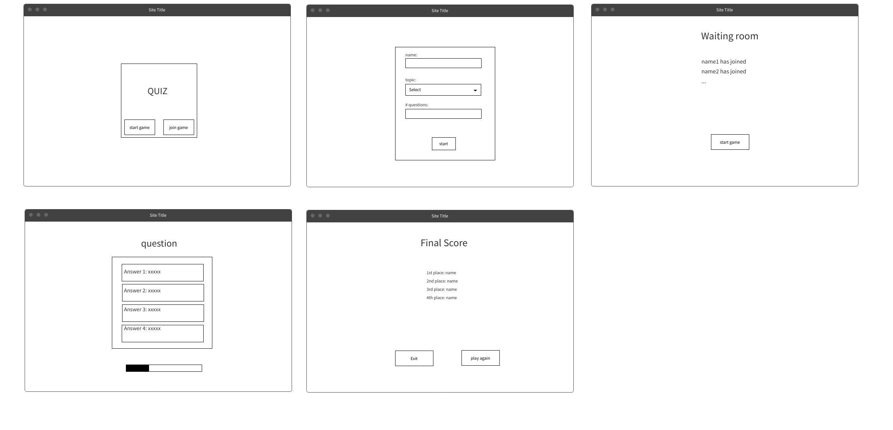

# QuizMongers

At the end of our studies, each group was asked to create a web app that follows the given theme of "entertainment". Our team decided to create a multiplayer trivia app. working together over the course of 3 days, we were able to divide the tasks, develop and present the final product.

| front-end       | back-end   |
| --------------- | ---------- |
| React           | Socketio   |
| Redux           | JavaScript |
| JavaScript      | Express    |
| React Lottie    |            |
| React Bootstrap |            |

# Video walk through

# Wireframes:

# User stories:

- As a user I want to be able to play a trivia game
- As a user I want to be able to create a game with my friends
- As a user I want to be able to be able to invite my friends to play a trivia game
- As a user I want to be able to see who recieved the highest score

# Repositories:

- frontend repo: https://github.com/avdalmi/QuizMongersFrontend
- backend repo: https://github.com/avdalmi/QuizMongersBackend

# Download instructions:

- `git clone <SSH>`
- `npm install `
- for the front end repository react-lottie might throw errors, in that case first: `npm install react-lottie --force` then `npm install`
